# Diagrama de Clases - Versión Compacta

Visualiza la estructura principal de controladores, servicios, EF Core, entidades, DTOs y patrón Factory.
**Optimizado para copiar/pegar completo en Mermaid Live Editor y exportar como PNG sin pixelación.**

## Diagrama Completo Optimizado

```mermaid
classDiagram
  direction TB
  
  %% Controllers
  class EstudiantesController {
    +GetAll(filtros)
    +GetById(id)
    +Create(dto)
    +Update(id, dto)
    +Delete(id)
    +GetTipoInfo(idTipo)
  }
  
  class CarrerasController {
    +GetAll()
    +GetById(id)
    +Create(dto)
  }
  
  class TiposEstudianteController {
    +GetAll()
    +GetById(id)
    +Create(dto)
  }

  %% Services Interfaces
  class IEstudianteService {
    <<interface>>
    +ObtenerEstudiantesAsync()
    +CrearEstudianteAsync()
    +ActualizarEstudianteAsync()
    +EliminarEstudianteAsync()
  }
  
  class ICarreraService {
    <<interface>>
    +ObtenerCarrerasAsync()
    +CrearCarreraAsync()
  }
  
  class ITipoEstudianteService {
    <<interface>>
    +ObtenerTiposAsync()
    +CrearTipoAsync()
  }

  %% Services Implementations
  class EstudianteService {
    +ObtenerEstudiantesAsync()
    +CrearEstudianteAsync()
    +ActualizarEstudianteAsync()
    +EliminarEstudianteAsync()
  }
  
  class CarreraService {
    +ObtenerCarrerasAsync()
    +CrearCarreraAsync()
  }
  
  class TipoEstudianteService {
    +ObtenerTiposAsync()
    +CrearTipoAsync()
  }

  %% Data Context
  class AppContext {
    +DbSet~Carreras~ Carreras
    +DbSet~Estudiantes~ Estudiantes
    +DbSet~TiposEstudiante~ TiposEstudiante
    +OnModelCreating()
  }

  %% Entities
  class Estudiantes {
    +int IdEstudiante
    +string Matricula
    +string NombreCompleto
    +sbyte Semestre
    +decimal Promedio
    +int IdCarreraFk
    +int IdTipoEstudianteFk
  }

  class Carreras {
    +int IdCarrera
    +string NombreCarrera
  }

  class TiposEstudiante {
    +int IdTipoEstudiante
    +string NombreTipo
  }

  %% DTOs
  class EstudianteDto {
    +int IdEstudiante
    +string Matricula
    +string NombreCompleto
    +sbyte Semestre
    +decimal Promedio
    +string NombreCarrera
    +string TipoEstudiante
  }

  class EstudianteCreateDto {
    +string Matricula
    +string NombreCompleto
    +sbyte Semestre
    +decimal Promedio
    +int IdCarrera
    +int IdTipoEstudiante
  }

  class CarreraDto {
    +int IdCarrera
    +string NombreCarrera
    +int TotalEstudiantes
  }

  class TipoEstudianteDto {
    +int IdTipoEstudiante
    +string NombreTipo
    +int TotalEstudiantes
  }

  class ApiResponse~T~ {
    +bool Success
    +string Message
    +T Data
    +List~string~ Errors
  }

  class PaginatedResponse~T~ {
    +List~T~ Data
    +int TotalRecords
    +int Page
    +int PageSize
    +bool HasNextPage
  }

  %% Factory Pattern
  class EstudianteFactoryProvider {
    +ObtenerFactory(int) EstudianteFactory
    +CrearEstudiantePorTipo(int) EstudianteBase
  }
  
  class EstudianteFactory {
    <<abstract>>
    +CrearEstudiante() EstudianteBase
  }
  
  class EstudianteRegularFactory {
    +CrearEstudiante() EstudianteRegular
  }
  
  class EstudianteBecadoFactory {
    +CrearEstudiante() EstudianteBecado
  }
  
  class EstudianteEgresadoFactory {
    +CrearEstudiante() EstudianteEgresado
  }

  class EstudianteBase {
    <<abstract>>
    +ObtenerDescripcion() string
    +CalcularDescuentoMatricula(decimal) decimal
    +PuedeRecibirBecas() bool
    +ObtenerPrioridadInscripcion() int
  }
  
  class EstudianteRegular {
    +ObtenerDescripcion() "Estudiante Regular"
    +CalcularDescuentoMatricula(monto) monto
    +PuedeRecibirBecas() true
    +ObtenerPrioridadInscripcion() 3
  }
  
  class EstudianteBecado {
    +ObtenerDescripcion() "Estudiante Becado"
    +CalcularDescuentoMatricula(monto) monto * 0.5
    +PuedeRecibirBecas() false
    +ObtenerPrioridadInscripcion() 1
  }
  
  class EstudianteEgresado {
    +ObtenerDescripcion() "Estudiante Egresado"
    +CalcularDescuentoMatricula(monto) monto * 0.75
    +PuedeRecibirBecas() false
    +ObtenerPrioridadInscripcion() 2
  }

  %% Controller Dependencies
  EstudiantesController ..> IEstudianteService : depende
  EstudiantesController ..> EstudianteFactoryProvider : usa
  CarrerasController ..> ICarreraService : depende
  TiposEstudianteController ..> ITipoEstudianteService : depende

  %% Service Implementation
  IEstudianteService <|.. EstudianteService
  ICarreraService <|.. CarreraService
  ITipoEstudianteService <|.. TipoEstudianteService

  %% Data Access
  EstudianteService ..> AppContext : usa
  CarreraService ..> AppContext : usa
  TipoEstudianteService ..> AppContext : usa

  %% Entity Relationships
  Estudiantes --> Carreras : IdCarreraFk
  Estudiantes --> TiposEstudiante : IdTipoEstudianteFk

  %% Factory Relationships
  EstudianteFactoryProvider ..> EstudianteFactory : crea
  EstudianteFactory <|-- EstudianteRegularFactory
  EstudianteFactory <|-- EstudianteBecadoFactory
  EstudianteFactory <|-- EstudianteEgresadoFactory
  
  EstudianteBase <|-- EstudianteRegular
  EstudianteBase <|-- EstudianteBecado
  EstudianteBase <|-- EstudianteEgresado
  
  EstudianteRegularFactory ..> EstudianteRegular : crea
  EstudianteBecadoFactory ..> EstudianteBecado : crea
  EstudianteEgresadoFactory ..> EstudianteEgresado : crea
```

---

## Instrucciones para Mermaid Live Editor:

1. **Copia todo el código** del bloque `mermaid` de arriba
2. **Pégalo en [mermaid.live](https://mermaid.live/)**
3. **Ajusta el zoom** para ver todo el diagrama completo
4. **Exporta como PNG** con las siguientes configuraciones:
   - **Tamaño**: Large o Extra Large
   - **Calidad**: High (para evitar pixelación)
   - **Fondo**: Transparent o White según prefieras

### Optimizaciones aplicadas:
- ✅ **Comentarios organizadores** con `%%` para agrupar secciones
- ✅ **Dirección TB** (Top to Bottom) para mejor distribución vertical
- ✅ **Clases simplificadas** pero manteniendo información esencial
- ✅ **Relaciones claras** agrupadas al final del diagrama
- ✅ **Un solo bloque mermaid** para copy/paste fácil

Este diagrama unificado será mucho más fácil de manejar en Mermaid Live Editor y te dará una imagen PNG de alta calidad sin pixelación.