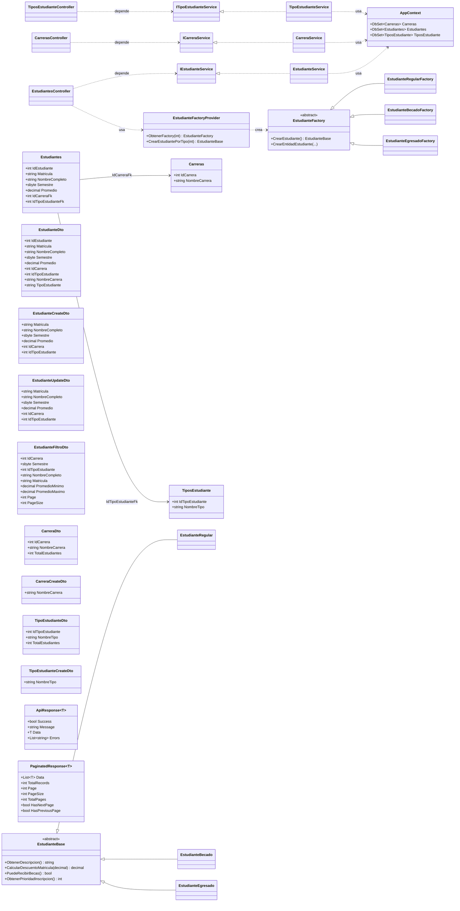

# Diagrama de Clases

Visualiza la estructura principal de controladores, servicios, EF Core, entidades, DTOs y patrón Factory.

```mermaid
classDiagram
  direction LR

  class EstudiantesController
  EstudiantesController ..> IEstudianteService : depende
  EstudiantesController ..> EstudianteFactoryProvider : usa

  class CarrerasController
  CarrerasController ..> ICarreraService : depende

  class TiposEstudianteController
  TiposEstudianteController ..> ITipoEstudianteService : depende

  interface IEstudianteService
  class EstudianteService
  IEstudianteService <|.. EstudianteService
  EstudianteService ..> AppContext : usa

  interface ICarreraService
  class CarreraService
  ICarreraService <|.. CarreraService
  CarreraService ..> AppContext : usa

  interface ITipoEstudianteService
  class TipoEstudianteService
  ITipoEstudianteService <|.. TipoEstudianteService
  TipoEstudianteService ..> AppContext : usa

  class AppContext{
    +DbSet~Carreras~ Carreras
    +DbSet~Estudiantes~ Estudiantes
    +DbSet~TiposEstudiante~ TiposEstudiante
  }

  class Estudiantes{
    +int IdEstudiante
    +string Matricula
    +string NombreCompleto
    +sbyte Semestre
    +decimal Promedio
    +int IdCarreraFk
    +int IdTipoEstudianteFk
  }

  class Carreras{
    +int IdCarrera
    +string NombreCarrera
  }

  class TiposEstudiante{
    +int IdTipoEstudiante
    +string NombreTipo
  }

  Estudiantes --> Carreras : IdCarreraFk
  Estudiantes --> TiposEstudiante : IdTipoEstudianteFk

  class EstudianteDto{
    +int IdEstudiante
    +string Matricula
    +string NombreCompleto
    +sbyte Semestre
    +decimal Promedio
    +int IdCarrera
    +int IdTipoEstudiante
    +string NombreCarrera
    +string TipoEstudiante
  }

  class EstudianteCreateDto{
    +string Matricula
    +string NombreCompleto
    +sbyte Semestre
    +decimal Promedio
    +int IdCarrera
    +int IdTipoEstudiante
  }

  class EstudianteUpdateDto{
    +string Matricula
    +string NombreCompleto
    +sbyte Semestre
    +decimal Promedio
    +int IdCarrera
    +int IdTipoEstudiante
  }

  class EstudianteFiltroDto{
    +int IdCarrera
    +sbyte Semestre
    +int IdTipoEstudiante
    +string NombreCompleto
    +string Matricula
    +decimal PromedioMinimo
    +decimal PromedioMaximo
    +int Page
    +int PageSize
  }

  class CarreraDto{
    +int IdCarrera
    +string NombreCarrera
    +int TotalEstudiantes
  }

  class CarreraCreateDto{
    +string NombreCarrera
  }

  class TipoEstudianteDto{
    +int IdTipoEstudiante
    +string NombreTipo
    +int TotalEstudiantes
  }

  class TipoEstudianteCreateDto{
    +string NombreTipo
  }

  class ApiResponse~T~{
    +bool Success
    +string Message
    +T Data
    +List~string~ Errors
  }

  class PaginatedResponse~T~{
    +List~T~ Data
    +int TotalRecords
    +int Page
    +int PageSize
    +int TotalPages
    +bool HasNextPage
    +bool HasPreviousPage
  }

  class EstudianteFactory{
    <<abstract>>
    +CrearEstudiante() EstudianteBase
    +CrearEntidadEstudiante(...)
  }
  class EstudianteRegularFactory
  class EstudianteBecadoFactory
  class EstudianteEgresadoFactory
  EstudianteFactory <|-- EstudianteRegularFactory
  EstudianteFactory <|-- EstudianteBecadoFactory
  EstudianteFactory <|-- EstudianteEgresadoFactory

  class EstudianteBase{
    <<abstract>>
    +ObtenerDescripcion() string
    +CalcularDescuentoMatricula(decimal) decimal
    +PuedeRecibirBecas() bool
    +ObtenerPrioridadInscripcion() int
  }
  class EstudianteRegular
  class EstudianteBecado
  class EstudianteEgresado
  EstudianteBase <|-- EstudianteRegular
  EstudianteBase <|-- EstudianteBecado
  EstudianteBase <|-- EstudianteEgresado

  class EstudianteFactoryProvider{
    +ObtenerFactory(int) EstudianteFactory
    +CrearEstudiantePorTipo(int) EstudianteBase
  }
  EstudianteFactoryProvider ..> EstudianteFactory : crea
```