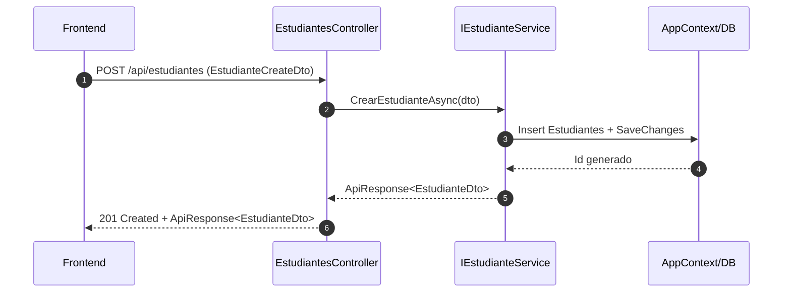

# Secuencia: Crear Estudiante (POST /api/estudiantes)

```mermaid
sequenceDiagram
  autonumber
  participant FE as Frontend
  participant C as EstudiantesController
  participant S as IEstudianteService
  participant DB as AppContext/DB

  FE->>C: POST /api/estudiantes (EstudianteCreateDto)
  C->>S: CrearEstudianteAsync(dto)
  S->>DB: Insert Estudiantes + SaveChanges
  DB-->>S: Id generado
  S-->>C: ApiResponse<EstudianteDto>
  C-->>FE: 201 Created + ApiResponse<EstudianteDto>
```