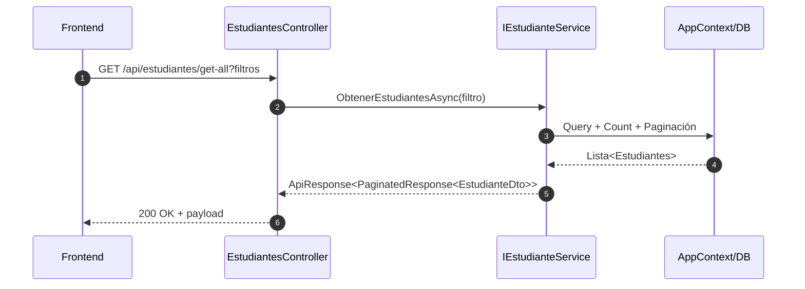

# Secuencia: Listar Estudiantes (GET /api/estudiantes/get-all)

```mermaid
sequenceDiagram
  autonumber
  participant FE as Frontend
  participant C as EstudiantesController
  participant S as IEstudianteService
  participant DB as AppContext/DB

  FE->>C: GET /api/estudiantes/get-all?filtros
  C->>S: ObtenerEstudiantesAsync(filtro)
  S->>DB: Query + Count + Paginación
  DB-->>S: Lista<Estudiantes>
  S-->>C: ApiResponse<PaginatedResponse<EstudianteDto>>
  C-->>FE: 200 OK + payload
```