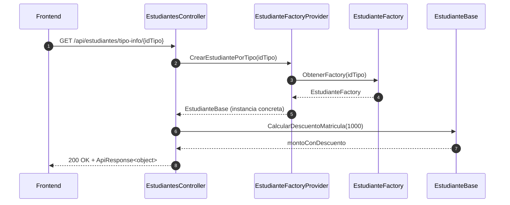

# Secuencia: Info Tipo de Estudiante (GET /api/estudiantes/tipo-info/{id})

```mermaid
sequenceDiagram
  autonumber
  participant FE as Frontend
  participant C as EstudiantesController
  participant FP as EstudianteFactoryProvider
  participant F as EstudianteFactory
  participant T as EstudianteBase

  FE->>C: GET /api/estudiantes/tipo-info/{idTipo}
  C->>FP: CrearEstudiantePorTipo(idTipo)
  FP->>F: ObtenerFactory(idTipo)
  F-->>FP: EstudianteFactory
  FP-->>C: EstudianteBase (instancia concreta)
  C->>T: CalcularDescuentoMatricula(1000)
  T-->>C: montoConDescuento
  C-->>FE: 200 OK + ApiResponse<object>
```